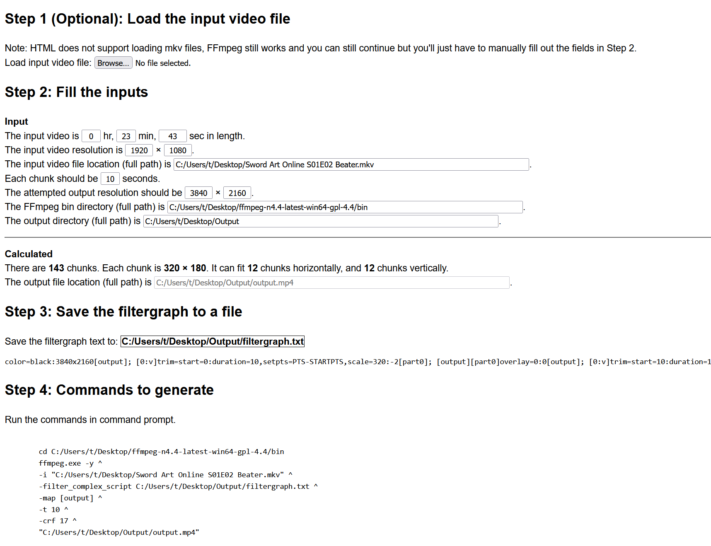

# Video Zoetrope Generator
The webpage will generate a series of commands of a given video input. The commands then can be used with FFmpeg to generate a video zoetrope.

## Working Demo
TODO

## Try It Out
https://hyssopi.github.io/Video-Zoetrope-Generator/

## Prerequisites
`FFmpeg` required.

## Build
(None)

## Run
Open `index.html` in a web browser.

## Test
(None)
